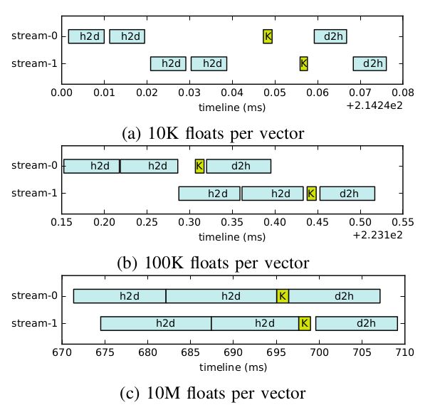

# h2d_overlapping
benchmarking the overlapping for multiple cuda streams

## Background
When running multiple cuda streams to explore the concurrency for data transfer, the actual starting point of launching next cuda stream depends on the cuda driver and gpu device.

This boilerplate helps identify the starting point.
</img>
